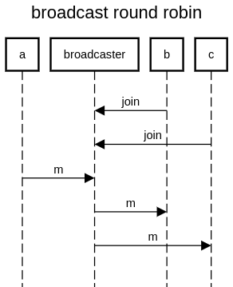

this pattern is also called router (but the broadcast is a simplied version of the router pattern)



```
title broadcast round robin

participant a
participant broadcaster
participant b
participant c

b->broadcaster:join
c->broadcaster:join
a->broadcaster:m
broadcaster->b:m
broadcaster->c:m
```

https://sequencediagram.org/index.html#initialData=C4S2BsFMAICMCcD2BDAJgY2QZ2NJBXAO1T0VhEIChKAHZeUdEOw3ZW+x55VuJNTDkjwODEExa5YorpOjpqsALQA+BCgzZgwgFwArRBUrpV6gVt0GjyU-01D4OgLaUz97fFPPXdwR9Xo3kA
