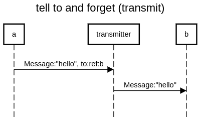

**tell** to is also called **transmit** or **forward**

you can code it yourself with a "transmitter" actor or you can use the forward pattern already existing in AKKA that uses a "mediator" actor

https://doc.akka.io/docs/akka/current/actors.html#forward-message 



```
title tell to and forget (transmit)

a->transmitter:Message:"hello", to:ref:b
transmitter->b:Message:"hello"
```

https://sequencediagram.org/index.html#initialData=C4S2BsFMAJk9ywPbQIYDsAm0BmSBOA5pMNABTD4YDOAtmAJQBQTqAtAHyU33Bz4AuALKRq1VMQEAiABbxwSKQBpkA-JBwCARk27o6Yfpy3DR4ybPmKmQA
