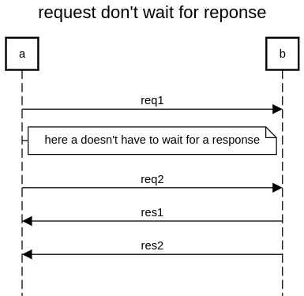

```
title request don't wait for reponse

a->b:req1
note right of a:here a doesn't have to wait for a response
a->b:req2
b->a:res1
b->a:res2
```

https://sequencediagram.org/index.html#initialData=C4S2BsFMAICdII4FdIGdjQCYHsB2ByDAdwEMxoAzbWOSABz1UgChmSBaAPgCMAueBAEZmubMBiwQAcwAWGbBWgleMyPCVZsaAhhkkAbjGDZopclRolaqBriZsufAQCZm3Lsviph7zp7SuQA
