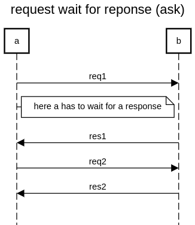

request response is also called ASK pattern in Akka 

this ask is waiting using a future with Await.result.

https://doc.akka.io/docs/akka/current/futures.html

more documentation: https://doc.akka.io/docs/akka/current/actors.html#ask-send-and-receive-future 

You can also attach callbacks for completion (success/failure) or simply map over it and chain multiple Futures together in a monadic fashion.

```
Timeout timeout = Timeout.create(Duration.ofSeconds(5));
Future<Object> future = Patterns.ask(b,new Request("req1"), timeout);
Responre res1 = (Response) Await.result(future, timeout.duration());
```

Be careful to distinguish between Java Futures and Akka Futures. In java, you use Futures with a blocking get. You can't get the value without blocking:

```
future.get(1, TimeUnit.SECONDS);
```




```
title request wait for reponse (ask)

a->b:req1
note right of a:here a has to wait for a response
b->a:res1
a->b:req2
b->a:res2

```

https://sequencediagram.org/index.html#initialData=C4S2BsFMAICdII4FdIGdjQO4EMzQGYD2sckADoQHaowAU2qA1gJQBQr2AtAHwBGAXPAQBGVpULAYsEAHMAFhkL5o2fnMjwV0OQ2jBCWXBiIlspVBWqRWvHqvipRXPoMQAmG3deoPQA
