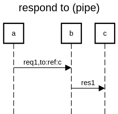

this one ressembles the tell to pattern

it is also called the pipe pattern



```
title respond to (pipe)

a->b:req1,to:ref:c
b->c:res1

```

https://sequencediagram.org/index.html#initialData=C4S2BsFMAICdIM4AcD2A7AJtYLoAokQlIBKAKDIEMBaAPgCMAueARwEYAaHZyAM0YDGZenQE8EbMkA 
